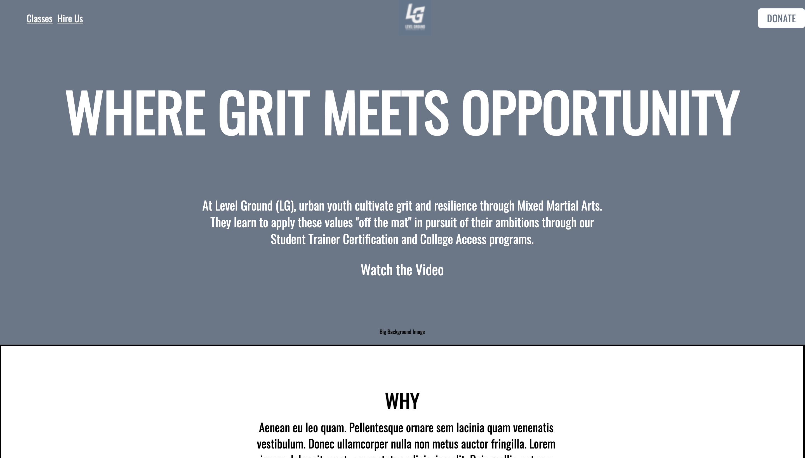

# 🎰 Week05 Bootcamp2019 Project: Level Ground

### Goal: Replicate the home page of the Level Ground website

This is my attempt at replicating the Level Ground! 

</img>

Link to live site: [https://danielmtran-levelground.netlify.app]

### How It's Made:

Tech used: HTML and CSS

### Optimizations:

### Lessons Learned:

This project helped me get started with my fundamentals for Flex Box!